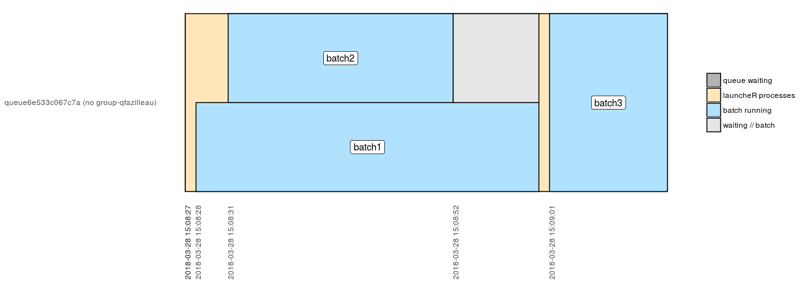
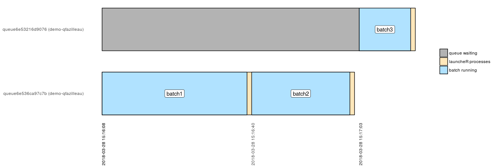
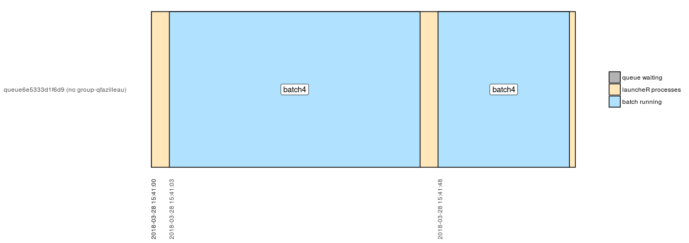

<!-- README.md is generated from README.Rmd. Please edit that file -->
Overview
--------

The goal of launcheR is to easily launch R scripts with the following features :

-   Waiting queue management
-   Easy set of parameters
-   Send processes in background

Install launcheR
----------------

``` r
devtools::install_github("qfazille/launcheR")
```

Quick examples
--------------

Create fake batch to run the examples below

``` r
# Create examples batchs
cat("Sys.sleep(30)", file = "batch1.R")
cat("Sys.sleep(20)", file = "batch2.R")
cat("Sys.sleep(10)", file = "batch3.R")
```

Run `batch1.R` with launcheR

``` r
library(launcheR)

# create queue
q <- createQueue()

# Add batchs batch1.R
q <- addBatch(object = q, path = "./batch1.R")

# launch queue
launch(q)
```

``` r
# Visualize last queue
vis(last = 1)
```


Multiple batch
--------------

Run `batch1.R` and then `batch2.R` with launcheR

``` r
q <- createQueue()
q <- addBatch(object = q, path = "./batch1.R")
q <- addBatch(object = q, path = "./batch2.R")
launch(q)
```

``` r
vis(last = 1)
```


WaitBeforeNext
--------------

Run `batch1.R` and `batch2.R` at the same time and then `batch3.R` with launcheR

``` r
q <- createQueue()
q <- addBatch(object = q, path = "./batch1.R", waitBeforeNext = FALSE)
q <- addBatch(object = q, path = "./batch2.R")
q <- addBatch(object = q, path = "./batch3.R")
launch(q)
```

``` r
vis(last = 1)
```



Group
-----

When creating a queue, you can define a **group**.

> Only one queue by group can run at the same time

Create 2 queues that belong to the same group and launch them.

``` r
# create 2 queues
q1 <- createQueue(group = "demo")
q2 <- createQueue(group = "demo")

# Add batch1.R & batch2.R in q1
q1 <- addBatch(object = q1, path = "./batch1.R")
q1 <- addBatch(object = q1, path = "./batch2.R")

# Add batch3.R in q2
q2 <- addBatch(object = q2, path = "./batch3.R")

# launch queues
launch(q1)
launch(q2)
```

``` r
# visualize last 2 queueid
vis(last = 2)
```



parallelizable
--------------

> If a batch is set to `parallelizable = FALSE` then any other queue cannot run this batch at the same time.

``` r
# create 2 queues
q1 <- createQueue()
q2 <- createQueue()

# Add batch1.R & batch2.R in q1
q1 <- addBatch(object = q1, path = "./batch1.R", parallelizable = FALSE)
q1 <- addBatch(object = q1, path = "./batch2.R")

# Add batch3.R in q2
q2 <- addBatch(object = q2, path = "./batch1.R")

# launch queues
launch(q1)
launch(q2)
```

``` r
vis(last = 2)
```


Using arguments on a batch
--------------------------

`batch4.R` below needs a numeric variable named `time_to_wait`

``` r
# Create examples batchs
cat("Sys.sleep(time_to_wait)", file = "batch4.R")
```

> Warning : The parameters `params` must be a named list

``` r
q <- createQueue()
# Add batch4.R multiple times with different time_to_wait
q <- addBatch(object = q, path = "./batch4.R", params = list(time_to_wait = 40))
q <- addBatch(object = q, path = "./batch4.R", params = list(time_to_wait = 20))
launch(q)
```

``` r
vis(last = 1)
```



**No limit of element number or type (including objects).**
