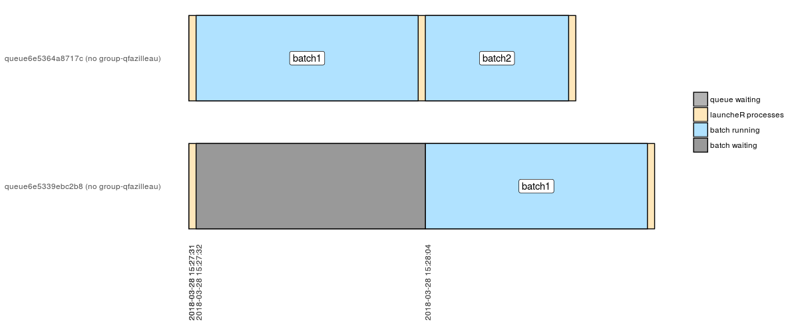
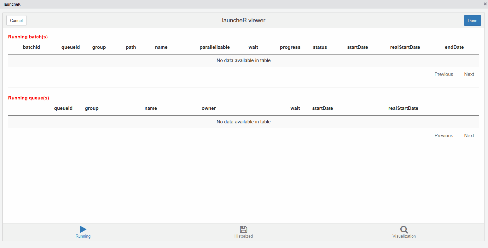

<!-- README.md is generated from README.Rmd. Please edit that file -->
Overview
--------

The goal of launcheR is to easily launch R scripts with the following features :

-   Waiting queue management
-   Easy set of parameters
-   Send processes in background

Install launcheR
----------------

``` r
devtools::install_github("qfazille/launcheR")
```

Quick examples
--------------

Create fake batch to run the examples below

``` r
# Create examples batchs
cat("Sys.sleep(30)", file = "batch1.R")
cat("Sys.sleep(20)", file = "batch2.R")
cat("Sys.sleep(10)", file = "batch3.R")
```

Run `batch1.R` with launcheR

``` r
library(launcheR)

# create queue
q <- createQueue()

# Add batchs batch1.R
q <- addBatch(object = q, path = "./batch1.R")

# launch queue
launch(q)
```

``` r
# Visualize last queue
vis(last = 1)
```


Multiple batch
--------------

Run `batch1.R` and then `batch2.R` with launcheR

``` r
q <- createQueue()
q <- addBatch(object = q, path = "./batch1.R")
q <- addBatch(object = q, path = "./batch2.R")
launch(q)
```

``` r
vis(last = 1)
```


WaitBeforeNext
--------------

Run `batch1.R` and `batch2.R` at the same time and then `batch3.R` with launcheR

``` r
q <- createQueue()
q <- addBatch(object = q, path = "./batch1.R", waitBeforeNext = FALSE)
q <- addBatch(object = q, path = "./batch2.R")
q <- addBatch(object = q, path = "./batch3.R")
launch(q)
```

``` r
vis(last = 1)
```


Group
-----

When creating a queue, you can define a **group**.

> Only one queue by group can run at the same time

Create 2 queues that belong to the same group and launch them.

``` r
# create 2 queues
q1 <- createQueue(group = "demo")
q2 <- createQueue(group = "demo")

# Add batch1.R & batch2.R in q1
q1 <- addBatch(object = q1, path = "./batch1.R")
q1 <- addBatch(object = q1, path = "./batch2.R")

# Add batch3.R in q2
q2 <- addBatch(object = q2, path = "./batch3.R")

# launch queues
launch(q1)
launch(q2)
```

``` r
# visualize last 2 queueid
vis(last = 2)
```


parallelizable
--------------

> If a batch is set to `parallelizable = FALSE` then any other queue cannot run this batch at the same time.

``` r
# create 2 queues
q1 <- createQueue()
q2 <- createQueue()

# Add batch1.R & batch2.R in q1
q1 <- addBatch(object = q1, path = "./batch1.R", parallelizable = FALSE)
q1 <- addBatch(object = q1, path = "./batch2.R")

# Add batch1.R in q2
q2 <- addBatch(object = q2, path = "./batch1.R")

# launch queues
launch(q1)
launch(q2)
```

``` r
vis(last = 2)
```



Using arguments on a batch
--------------------------

`batch4.R` below needs a numeric variable named `time_to_wait`

``` r
# Create examples batchs
cat("Sys.sleep(time_to_wait)", file = "batch4.R")
```

> Warning : The parameters `params` must be a named list

``` r
q <- createQueue()
# Add batch4.R multiple times with different time_to_wait
q <- addBatch(object = q, path = "./batch4.R", params = list(time_to_wait = 40))
q <- addBatch(object = q, path = "./batch4.R", params = list(time_to_wait = 20))
launch(q)
```

``` r
vis(last = 1)
```


**No constraint on number and type of parameters (including objects).**

Addins & Progress
-----------------

> Keep track of your batchs progress with the Addins & launcheR::progress

The RStudio Addins contains

-   running queue(s)
-   historized queue(s)
-   queue(s) visualization

**batch6.R**

``` r
library(launcheR)

stopifnot(exists("time_to_wait"))

advance <- 0
wait_loop <- round(time_to_wait / 10)

for (i in 1:10) {
    Sys.sleep(wait_loop)
    advance <- advance + 10
    progress(advance)
}
```

``` r
q <- createQueue(name = "demo_addins")
q <- addBatch(q, path = "./batch6.R", params = list(time_to_wait = 20))
launch(q)
```



Addins visualization
--------------------

> Have a good scheduling overview

``` r
q1 <- createQueue(name = "demo_queue1", group = "demo", folder = ".", clean = FALSE)
q1 <- addBatch(q1, path = "./batch6.R", params = list(time_to_wait = 20), waitBeforeNext = FALSE)
q1 <- addBatch(q1, path = "./batch6.R", params = list(time_to_wait = 30))

q2 <- createQueue(name = "demo_queue2", group = "demo")
q2 <- addBatch(q2, path = "./batch6.R", params = list(time_to_wait = 10))

q3 <- createQueue(name = "demo_queue3", group = "other_group")
q3 <- addBatch(q3, path = "./batch6.R", params = list(time_to_wait = 50))

launch(q1)
launch(q2)
launch(q3)
```

Behind the scene
----------------

`launcheR` creates a folder that contains

-   `.RData` with parameters
-   `.Renviron` with internal informations
-   `logs` folder
-   `run.sh` the shell file that launch scripts
-   `run.log` log of shell file

Available customization in `createQueue` function :

-   `folder` the location where the above folder is created (Default tempdir())
-   `clean` if this folder is kept or not at the end of the queue (Default TRUE)
-   `logs` if you want to set the logs folder location elsewhere.
-   `name` & `owner` if you want to change the username that appears in running & historized queue(s)
-   `tmpdir` to be redefined if you use (RStudio Connect &lt; 1.5.10)

Available customization in `addBatch` function :

-   `name` if you want to change the batch name that appears in running & historized batch(s)
-   `logfile` if you want to redirect log in a particular file
